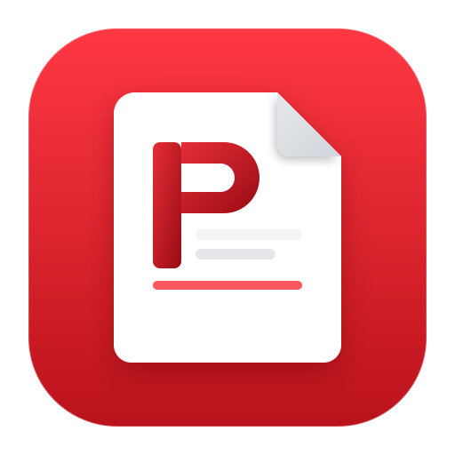

# PdfCraft app icon



**Mark:** a white page with a folded corner, a geometric **P**, two body-text rules and a red
accent bar, on a red squircle.

**Style:** a flat document tile. The P is a rounded stem with a loop only on the upper part, so
the stem hangs below and it reads as P (not D) at 16 px.

**Palette:**

| Colour | Hex | Used for |
|---|---|---|
| Field (top) | `#FF3843` | upper squircle |
| Field (bottom) | `#BA121B` | lower squircle |
| Letter (top) | `#E52E38` | P |
| Letter (bottom) | `#990B13` | P |
| Paper | `#ffffff` | the page |
| Fold | `#E5E7EB` → `#D1D5DB` | dog-ear |
| Rules | `#F3F4F6` / `#E5E7EB` | implied body text |
| Accent | `#FF3843` | underline on the page |

**Tile:** `viewBox="0 0 512 512"`. The red squircle is `x=32 y=32` size 448, `rx=100`, with a
transparent margin. Windows, Linux and macOS all render that 512 tile (no extra Apple-grid wrap,
the margin is already in the SVG).

**Provenance:** contributor-original SVG (the source mark as drawn). Licence: [LICENSE.txt](LICENSE.txt)
(`MIT OR Apache-2.0`, like the repo).

## Files

| File | What it is |
|---|---|
| `pdfcraft.svg` | the master vector; every PNG, `.ico` and `.icns` is rendered from it |
| `pdfcraft-small.svg` | the same mark, for places where size matters, such as this README |
| `pdfcraft-1024.png` | 1024 px; also the runtime Dock icon on macOS |
| `pdfcraft.icns` | macOS icon (16–1024 px) |
| `pdfcraft.ico` | Windows icon (16–256 px), embedded in `pdfcraft.exe` by `apps/pdfcraft/build.rs` |
| `hicolor/<n>x<n>/apps/ai.storyteller.pdfcraft.png` | Linux hicolor theme, 16–512 px; the 256 px one is the runtime icon on Windows and Linux |
| `hicolor/scalable/apps/ai.storyteller.pdfcraft.svg` | Linux scalable icon (copy of the master) |

Where it shows: `apps/pdfcraft/src/main.rs` sets the window icon (Dock, taskbar, Alt-Tab, launcher) and the
Wayland app id `ai.storyteller.pdfcraft`; `packaging/linux/ai.storyteller.pdfcraft.desktop` names the
hicolor icon.

## Regenerate

```sh
packaging/icons.sh        # needs resvg or cairosvg, and python3; iconutil (macOS) for the .icns
cargo xtask assets        # then update the sha256 values in ATTRIBUTION.toml and run with --write
```
